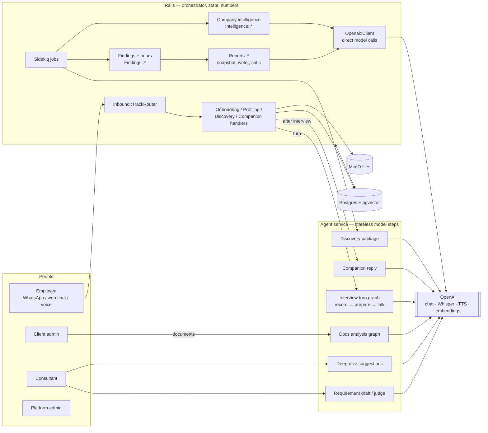
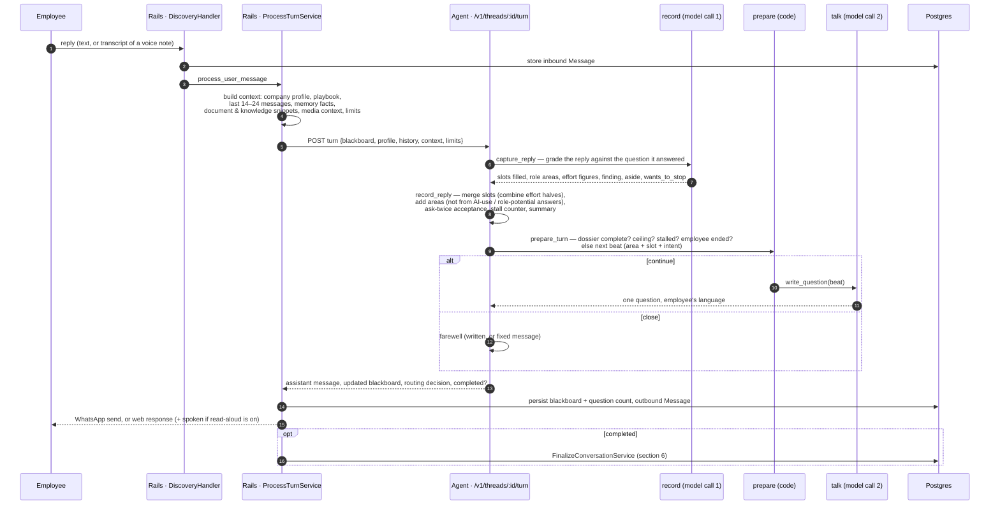
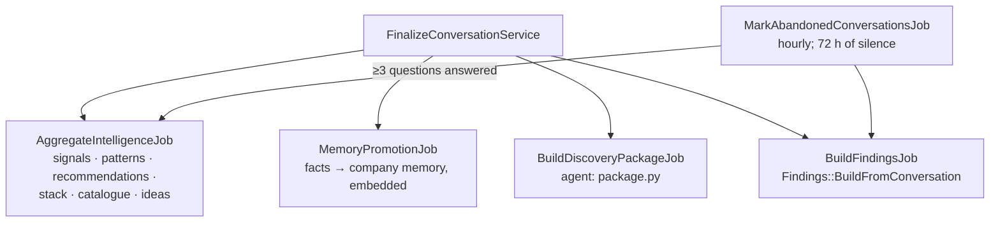
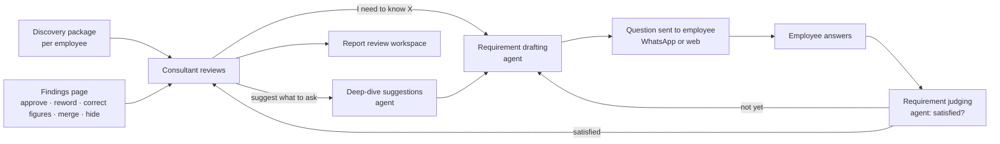
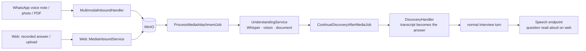
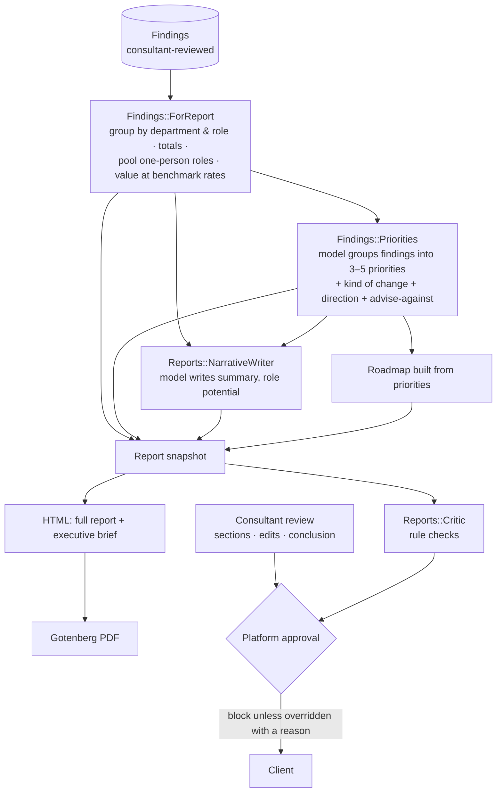

# How Mjadi's agents work

The current, code-verified map of every model-backed component in Mjadi: what each
one does, what calls it, what it reads and writes, how they hand work to each other,
and whether the design is on the right track.

Verified against `review-changes-v2` on 8 October 2026. Supersedes
[`AGENT_ARCHITECTURE.md`](AGENT_ARCHITECTURE.md) (the retired specialist-queue engine).
For the interview's design rationale see also
[`TECHNICAL_REVIEW_AGENTS_AND_REPORTING.md`](TECHNICAL_REVIEW_AGENTS_AND_REPORTING.md).

---

## Contents

1. [The short version](#1-the-short-version)
2. [The three rules everything follows](#2-the-three-rules-everything-follows)
3. [System map](#3-system-map)
4. [Every model-backed component](#4-every-model-backed-component)
5. [Flow 1 — an interview turn](#5-flow-1--an-interview-turn)
6. [Flow 2 — when an interview ends](#6-flow-2--when-an-interview-ends)
7. [Flow 3 — the consultant loop](#7-flow-3--the-consultant-loop)
8. [Flow 4 — documents](#8-flow-4--documents)
9. [Flow 5 — voice, images and files](#9-flow-5--voice-images-and-files)
10. [Flow 6 — the companion after the interview](#10-flow-6--the-companion-after-the-interview)
11. [Flow 7 — company intelligence](#11-flow-7--company-intelligence)
12. [Flow 8 — findings to the client's report](#12-flow-8--findings-to-the-clients-report)
13. [How the agents collaborate](#13-how-the-agents-collaborate)
14. [Reliability, safety and failure modes](#14-reliability-safety-and-failure-modes)
15. [Models and configuration](#15-models-and-configuration)
16. [Are we on the right track?](#16-are-we-on-the-right-track)

---

## 1. The short version

Mjadi is not a swarm of autonomous agents talking to each other. It is **one
orchestrator (Rails) that calls narrow, single-purpose model steps**, each with a
fixed input, a fixed output shape, and a deterministic fallback.

- **Rails owns all state and all decisions about what happens next.** It stores every
  conversation, decides which handler a message goes to, schedules the follow-on
  jobs, and computes every number that reaches a client.
- **The agent service (Python, FastAPI + LangGraph, `agent/`) owns the interview's
  model calls** and a few other conversational steps. It is stateless: each request
  carries the whole conversation state in and returns it out.
- **Some model steps run directly from Rails** (reports, priorities, transcription,
  documents, speech) through `Openai::Client`.
- **"Collaboration" happens through shared records, not messages between agents.**
  The interview writes a *blackboard*; Rails turns it into *findings*; findings feed
  *priorities* and the *report*; the consultant edits findings and the report; a rule
  *critic* checks the result. Each step reads the previous step's output.

There are **14 distinct model-backed steps** (section 4). On a typical company:
~2 model calls per interview turn, ~4 jobs when an interview ends, and 3 model calls to
write a report.

---

## 2. The three rules everything follows

These are the design's load-bearing principles. Almost every bug fixed in September and
October was a place one of them had been broken.

**1. Deterministic control, generative content.**
Code decides *what* happens (what to ask next, when to stop, what counts, what a total
is). A model only decides *how to say it* or *what a reply contained*. Example: the
interview's next question topic is chosen by `area_flow.prepare()`; the model only
words it. Hours are computed in Ruby (`Findings::AnnualHours`); no model ever produces
a number of hours.

**2. Record, never calculate.**
When a model reads something a person said, it records their words and the numbers they
used ("every morning", "40–60 minutes"). Arithmetic, totals, rankings and rounding happen
in code, so every figure in a report reconciles with the rows beneath it.

**3. Every model step fails safe.**
Each step has a fallback that keeps the product honest when the model is down,
truncated or wrong: an empty capture (the slot stays open and is asked again), a canned
question, a deterministic package, the largest findings as priorities, "not satisfied"
for a consultant's requirement. Transport outages raise a retryable error instead.

---

## 3. System map

**Process boundaries.**
- `rails` — API for the four portals, WhatsApp webhook, web interview API.
- `sidekiq` — every background job (findings, intelligence, packages, media,
  report generation, abandon sweep).
- `langgraph` — the agent service (`agent/app/main.py`), called over HTTP by
  `Langgraph::Client` (`backend/app/services/langgraph/client.rb`).
- `gotenberg` — HTML → PDF for reports. `minio` — files. `postgres` — everything
  else, including vectors.

---

## 4. Every model-backed component

| # | Component | Lives in | Triggered by | Model call(s) | Output | Fallback |
|---|---|---|---|---|---|---|
| 1 | **Interview capture** ("record") | agent `interview_capture.py` | every employee reply | 1 JSON call | slots filled, role areas, effort figures, finding, aside, stop signal | empty capture → slot asked again |
| 2 | **Interview question** ("talk") | agent `multi_agent_llm.write_question` | every turn that continues | 1 text call | the next question, in the employee's language | canned question for the topic |
| 3 | **Interview farewell** | agent `multi_agent_llm.write_farewell` | interview ends because the employee asked | 1 text call | warm close | fixed closing message |
| 4 | **Discovery package** | agent `package.py` | interview completed (job) | 1 JSON call | per-employee issues, solutions, follow-ups for the consultant | deterministic package from the blackboard |
| 5 | **Requirement drafting** | agent `requirements.draft_questions` | consultant states a need | 1 JSON call | 1–N questions an employee can answer | one plain question from the statement |
| 6 | **Requirement judging** | agent `requirements.evaluate_requirement` | each employee answer to a consultant question | 1 JSON call | satisfied? what's missing | **not satisfied** |
| 7 | **Deep-dive suggestions** | agent `deep_dive.py` | consultant opens suggestions | 1 JSON call | proposed needs + employee-facing wording + rationale | deterministic suggestions from the dossier's gaps |
| 8 | **Companion reply** | agent `companion.py` (+ Rails intent classifier, tools suggester) | employee writes after the interview | 1–3 calls | tip, tool answer, or note acknowledged | canned reply |
| 9 | **Docs analysis graph** | agent `docs_analysis_graph.py` | client runs "Analyze documents" | 1 per document + 1 for questions | knowledge entries, clarification questions | partial results |
| 10 | **Media understanding** | Rails `Multimodal::UnderstandingService` | voice note / photo / PDF arrives | Whisper, vision, or document extraction | transcript or structured text → fed into the interview | marks the file failed, tells the employee |
| 11 | **Agentic ideas** | Rails `Intelligence::AgenticIdeaWriter` | each intelligence refresh | 1 JSON call | 3–6 AI ideas per company | rule-based synthesizer |
| 12 | **Priorities + not recommended** | Rails `Findings::Priorities` | report generation | 1 JSON call | 3–5 grouped priorities with kind of change and direction; 1–3 things advised against | the largest findings, one each |
| 13 | **Report writer** | Rails `Reports::NarrativeWriter` | report generation | 1 JSON call | governing thought, summary, supporting points, role-potential lines | computed summary; roadmap from priorities |
| 14 | **Speech** | Rails `DiscoverSpeechController` | web interview reads a question aloud | TTS | MP3 of the question | the browser's own voice |

Not model-backed, but central: the **dossier and area flow** (what to ask next and when
to stop), **findings and hours**, **signal extraction** (keyword rules), the **report
critic** (rules), **interview health**, and **embeddings** used for memory retrieval and
catalogue matching.

---

## 5. Flow 1 — an interview turn

The interview is the heart of the product. It maps the person's own areas of work, learns
how each works and what snags, gets how often and how long for up to two of the worst
frictions, then asks what AI they use and what they would do with more time. It ends when
that *dossier* is full — not after a fixed number of questions.

### 5.1 Before the interview: onboarding and profiling (Rails only)

Message → `Whatsapp::InboundProcessor` (WhatsApp) or `Web::TurnRouter` (web) →
`Inbound::TrackRouter` → one of:

- **OnboardingHandler** — consent ("YES"), name, language detection.
- **ProfilingHandler** — a short form-like state machine: role, department, seniority,
  responsibilities, team size (managers), tools. No model.
- **DiscoveryHandler** — the interview proper (below).
- **ConsultantFollowupHandler / OutreachReplyHandler** — when a consultant's question is
  open for this person (section 7); checked first.
- **Companion::PostDiscoveryRouter** — after the interview (section 10).

When profiling ends, `Discovery::ProactiveStartService` synthesises a **kickoff message**
from the profile ("I'm Shiv, a Procurement Officer… supplier price updates, purchase
orders…") and runs the first turn on it, so the interview starts already knowing the
person's likely areas.

### 5.2 One turn, step by step

### 5.3 What lives on the blackboard

The blackboard (`conversations.state_snapshot["blackboard"]`) is the interview's whole
memory. It travels to the agent and back on every turn.

| Key | What it holds |
|---|---|
| `profile` | the profiling answers |
| `role_areas` | up to 3 named areas of the person's work (`MAX_AREAS = 3`) |
| `dossier.slots` | filled slots, keyed `slot::area`, each with value, confidence, the turn it came from, and for costs an `effort` object (how often, how long, as said + numbers + unit, effort type) |
| `dossier.parked` | asides worth following up but not chased now |
| `last_beat`, `last_phase` | the question just asked — what the next reply is graded against |
| `slot_attempts` | how many times each slot has been asked (ask twice, then accept what was given) |
| `stall_turns` | consecutive replies that filled nothing required |
| `shared_findings` | reusable facts the interview learned |
| `conversation_summary` | rolling summary, refreshed every 3 turns |
| `close_reason` | why it ended |

### 5.4 The dossier — what the interview needs to learn

- Per area (required): `how_it_works`, `friction`.
- Per area, once its friction is known, for up to **2** areas: `friction_cost` — how
  often and how long. A cost counts only when **both halves** are in (or it is pure
  waiting, or it was asked twice and the person couldn't say). If one half is missing,
  the next question asks for exactly that half.
- Once for the person: `ai_current_usage`, then `role_potential` (asked last, so the
  interview ends on what they would do with more time).

### 5.5 When it stops

Checked in this order by `area_flow.prepare`:

1. **Employee asked to stop** → warm farewell.
2. **Dossier complete** (and at least the floor of 4 questions) → close.
3. **Ceiling** (14 questions) → close.
4. **Stalled** (2 replies in a row that filled nothing) → close.
5. Below the floor with nothing left → **broaden** (ask about another area) rather than end early.

Limits come from company settings → environment → defaults
(`Discovery::ContextBuilder.limits_for`): max 14, min 4, stall 2, slot confidence 0.6.

### 5.6 Why two model calls, not one

Until September a single call did eight jobs — reply, next question, insight, finding,
slots, aside, areas, summary. On a weaker model the prose stayed good while the
structured fields came back empty, invisibly. Splitting into **record** (strict JSON,
temperature low) and **talk** (plain text) means:
- the next question is chosen from state that already includes the answer;
- a capture failure is visible (stamped on the turn as `capture_status`);
- the talk call stays short — which is also what a spoken interview needs.

---

## 6. Flow 2 — when an interview ends

`Discovery::FinalizeConversationService` marks the conversation and employee completed,
records a timeline event, notifies the client, and fans out four independent jobs:

- **Findings** (`Findings::BuildFromConversation`) — one finding per area with a
  confident friction: what happens now, what snags, how often, how long, effort type,
  hours a year (computed by the `Finding` model through `Findings::AnnualHours`),
  confidence, whether the role is held by one person, and a flag when two areas from the
  same interview carry identical figures (probable double count). Idempotent: a rebuild
  never overwrites a consultant's decision or correction.
- **Unfinished interviews still count.** An interview abandoned after ≥3 answers produces
  partial findings (lower confidence) and feeds the signals at half weight.
- **Memory promotion** turns shared findings into company memory facts with embeddings;
  later interviews at the same company retrieve the relevant ones as context.

---

## 7. Flow 3 — the consultant loop

The interview deliberately stays light. Depth is added later by the consultant, who by
then can see the whole company's evidence.

- **Two audiences in one output.** Deep-dive suggestions and drafted questions carry a
  `body` written for the employee (never mentions consultants, reviews or reports) and a
  `rationale` written for the consultant.
- **Caps protect the employee**: a limited number of follow-up questions per person.
- **Judging fails toward "not satisfied"** — wrongly closing a need loses the
  consultant's question silently; wrongly keeping it open costs one more question.
- **Findings review** is the consultant's main control over the numbers: approve, reword
  (overlay — the interview's words are kept), correct how often / how long (overlay; hours
  recomputed), merge the same work described twice (counted once), hide.

---

## 8. Flow 4 — documents

- **Upload** → `Multimodal::ParseDocumentService` extracts text (OCR fallback for scans),
  chunks and embeds it, and refreshes company intelligence.
- **Analyze documents** → agent `docs_analysis_graph.py`, a 7-node LangGraph:
  `coordinator → specialist (model call per document) → synthesizer → profile_grounder →
  question_generator (model call) → critic → reporter`. Output: knowledge entries and
  clarification questions for the client.
- **Clarification answers** → `Documents::ClarificationRagService` answers from the
  documents (retrieval + one model call).
- Documents feed **signals** and **interview context** (snippets retrieved per turn).
  They do **not** feed findings — see section 16.

---

## 9. Flow 5 — voice, images and files

- A spoken answer's transcript **is** the answer: it becomes the inbound message body and
  goes through the normal turn. The chat shows it labelled "Spoken answer".
- Transcription lets Whisper detect the language unless the person's is known.
- The recording keeps its real format (WebM from Chrome/Firefox and Safari 18.4+, MP4 from
  older Safari).
- Images and PDFs become structured text the turn sees as **untrusted media context**,
  wrapped so instructions inside a file cannot steer the interview.
- Voice is **turn-based**, not live: record → send → transcribe → reply (~12 s end to end
  on a typical answer). Live two-way voice is on the "Next" list.

---

## 10. Flow 6 — the companion after the interview

Once an interview is complete, further messages go to `Companion::PostDiscoveryRouter`:

1. **Intent classifier** (Rails, model) — casual, tool question, tip, or "add this to my
   interview".
2. "Add this to my interview" can **reopen discovery** for an addendum (Rails decides,
   within a budget).
3. Otherwise **companion reply** (agent `companion.py`) with context Rails assembles
   (insights, memory facts, recent notes); tool questions can pull suggestions
   (`Companion::ToolsSuggestService`). The companion must never re-interview.

---

## 11. Flow 7 — company intelligence

`Intelligence::AggregateCompanyIntelligence`, run after every interview, document and
media item:

1. **Signals** — `SignalExtractor`: six keyword rules (manual work, approvals, core
   systems, data silos, time sinks, coordination) over documents, interview answers and
   media. Strength from evidence counts; unfinished interviews at half weight.
2. **Patterns** — cross-department and recurring signals (`PatternDetector`).
3. **Recommendations** — rule-based from patterns (`RecommendationSynthesizer`).
4. **Client stack** — systems inferred from evidence.
5. **Catalogue match** — embeddings + keywords against the solutions catalogue.
6. **Agentic ideas** — model-written ideas, matched to existing ones by key words so a
   reworded idea refreshes instead of duplicating; drafts a run doesn't reproduce are
   archived.

This layer predates findings. With findings in place it now feeds only the report's
appendix (by default) and the client portal's "What we found". See section 16.

---

## 12. Flow 8 — findings to the client's report

What keeps the report honest:

- **Findings shown**: approved and unreviewed findings — never hidden or merged ones, never
  an unreviewed finding about a one-person role or a probable double count.
- **One-person roles never appear by name**: pooled into "Other roles" in the department,
  or across the company (department dropped too). Setting: `report_small_roles`.
- **Priorities**: the model returns only finding ids and words. Ruby checks every id,
  lets each finding sit in one priority, sums the hours, ranks. Words are dropped if they
  carry numbers, build detail, cost, timescale or a catalogue product name.
- **Writer**: may quote only figures present in the evidence (`Llm::GroundedNumbers`),
  sentence by sentence; hours exactly as given; never money, headcount or savings.
- **Money**: only from agreed benchmark rates (`BenchmarkRate`); none exist yet, so hours
  only.
- **Critic** (`Reports::Critic`) blocks approval on: totals that don't reconcile, findings
  changed since generation, a finding that reads as a quote, a named employee, salary or
  cut language, money without rates, build detail. Warns on overreach, few quantified
  findings, product names, the consultant's own money estimate.

---

## 13. How the agents collaborate

There are no agent-to-agent calls. Every hand-off goes through Rails and a stored
record:

| From | Writes | Read by |
|---|---|---|
| Interview turn | blackboard (dossier, areas, findings, asides) | next turn; package; findings; consultant workspace |
| Findings builder | `findings` rows | consultant Findings page; ForReport; critic; interview health |
| Consultant | finding overlays, merges, statuses; report section edits; requirements | ForReport; snapshot; critic; requirement loop |
| Requirement loop | outreach questions + answers | consultant; package (follow-ups) |
| Media | transcript / extracted text | the interview turn (as the answer or as context) |
| Documents | chunks + embeddings, knowledge entries | interview context; signals; clarification answers |
| Memory promotion | company memory facts + embeddings | later interviews at the same company |
| Intelligence | signals, patterns, recommendations, ideas | report appendix; client "What we found" |
| Priorities | priorities + not-recommended in the snapshot | report; brief; roadmap; writer; critic |

**Why this shape works:** each step can be tested alone, replayed, or replaced; a failure
in one never corrupts another's state; and a consultant can correct any stored record
before it flows further.

---

## 14. Reliability, safety and failure modes

| Concern | How it's handled |
|---|---|
| Model outage | Agent raises `openai_unavailable` (HTTP 503, retryable); Rails sends a short "back in a moment" and schedules `RetryDiscoveryTurnJob`. Circuit breakers on both sides stop hammering a dead endpoint. |
| Bad JSON / truncation | Capture retries once with a larger token cap, then degrades to an empty capture with a reason — not counted as an outage. |
| A reply the model misreads | Slots need confidence ≥ 0.6; effort halves are combined, not overwritten; implausible hours (more than one person's working year) are refused; turnaround time is never recorded as effort. |
| Repeated questions | Asked twice, then accepted as stated; stall exit after 2 empty replies. |
| Prompt injection via files | Media and document text is wrapped as untrusted context. |
| Employee privacy | Clients see participation status only; reports pool one-person roles; the critic blocks quotes and names. |
| Invented numbers | Grounded-number guard on every writer sentence; roadmap built from priorities; hours only from code. |
| Quality regressions | `agent/scripts/interview_replay.py` — 9 simulated employees scored on close reason, slots, costs, misreads, repeats; `rails demo:company_interviews` — 7 employees through the real path. Baseline 7–8 of 9. |
| Watching a pilot | Platform → Operations → Interviews (counts only), and `docs/PILOT_CHECKLIST.md`. |

---

## 15. Models and configuration

All model calls go to one OpenAI-compatible endpoint (`OPENAI_BASE_URL`, default
`https://api.openai.com/v1`). Local development can point it at LM Studio.

| Setting | Used for |
|---|---|
| `OPENAI_MODEL` | interview, package, requirements, deep dive, companion, priorities, writer, ideas |
| `REPORT_MODEL` | overrides `OPENAI_MODEL` for the writer and priorities |
| `DOCS_MODEL_FAST`, `DOCS_MODEL_REASONING` | docs analysis graph |
| `OPENAI_VISION_MODEL` | images |
| `OPENAI_WHISPER_MODEL` (whisper-1) | transcription |
| `OPENAI_TTS_MODEL` (gpt-4o-mini-tts), `OPENAI_TTS_VOICE` | read-aloud |
| `EMBEDDING_MODEL`, `EMBEDDING_DIMENSIONS` (768) | memory, documents, catalogue |
| `OPENAI_REASONING_EFFORT` | agent only; must be a value the model accepts (`gpt-6-luna`: none/low/medium/high/xhigh) |
| `OPENAI_JSON_MODE`, `OPENAI_MAX_TOKENS` | structured calls; token cap |

Compatibility handled in code: newer OpenAI models take `max_completion_tokens` (sent
automatically to the official endpoint) and accept only their default temperature
(omitted for gpt-5, gpt-6 and o-series models). Tested live on `gpt-4.1-mini` and
`gpt-6-luna`.

---

## 16. Are we on the right track?

**Yes, for the core.** The interview and the findings → report spine are built the right
way: code owns control and numbers, models own words, every step fails safe, a human
reviews before anything reaches a client, and there is a harness to measure changes.
This matches Masood's own "platform decides, model writes" and is the shape that
survives model changes — it moved from Gemma to gpt-4.1-mini to gpt-6-luna with three
small compatibility fixes.

**Where the architecture has drifted**, in order of how much it costs us:

1. **Two parallel "intelligence" layers.** The keyword signals → patterns →
   recommendations → ideas pipeline (section 11) and the findings → priorities pipeline
   (section 12) describe the same interviews twice, in different words, with different
   numbers. Signals use six regex rules; findings use the interview's own structured
   answers. The client portal still shows the signals version. **Recommendation:** make
   findings the single source. Rebuild the client's "What we found" on findings (redesign
   phase 5), drop the rule-based recommendations from the report, and feed ideas from
   priorities (or replace them with Masood's offerings catalogue).

2. **Two representations of each interview for the consultant.** The discovery package
   (issues, solutions, follow-ups) is a model summary of the blackboard; findings are a
   structured extraction of the same blackboard. Consultants see both in different
   screens. **Recommendation:** build the package's issues from findings (link by id), keep
   its follow-up suggestions, and show both in the one review pane (redesign phase 4).

3. **Documents never reach the findings.** Documents shape signals and interview context,
   but a friction evidenced in an SOP or a report never becomes a finding with hours.
   **Recommendation:** when Masood's deep dive or leadership conversation lands, let a
   consultant create a finding with `basis: "document"` from an analysed document — no new
   model step needed.

4. **The docs analysis "critic" is a formula** (`0.4 + 0.05 × entries`), not a check.
   Harmless, but misleading in event logs. **Recommendation:** rename it "coverage" or
   make it a real rule check.

5. **The legacy single-agent interview path still exists** (`agent/app/graph.py`,
   `llm.py`), reachable only if a company turns `discovery_multi_agent_enabled` off.
   **Recommendation:** remove it; it is untested against the current dossier.

6. **No per-call cost and latency record.** Turn quality is measured offline by the
   harness, but production keeps no record of tokens, latency or model per call.
   **Recommendation:** log model, tokens and duration on each `routing_decision` and in
   report generation, and surface them on the Interviews health page. Cheap, and it's
   what a pilot will need to answer "what does an interview cost?".

7. **Voice is turn-based.** Fine for a pilot; Masood's live two-way voice (Next tier)
   needs the record/talk split we already have, plus a realtime vendor.

**Not drift, but worth stating:** there is intentionally **no autonomous multi-agent
orchestration** (agents planning and calling each other). For a product whose output is
a client deliverable with numbers in it, that's the right call — every step is
inspectable, testable and correctable by a consultant. Add autonomy only where a human
reviews the result anyway (e.g. drafting a Stage 2 design for the consultant to edit).
