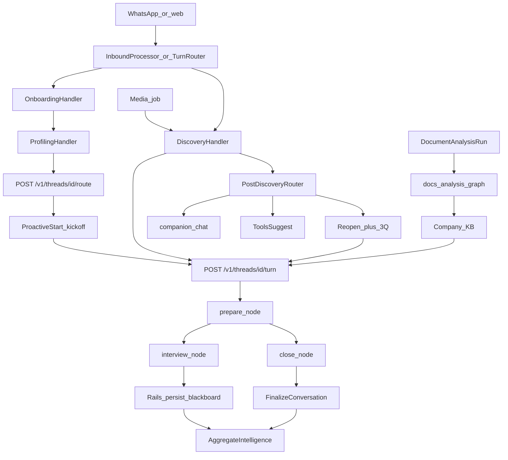
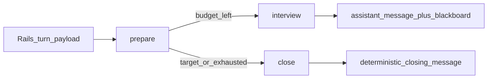
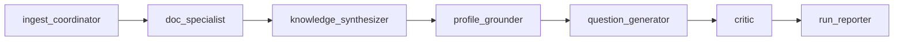

# Agent architecture

How Worktruth agents run, who owns state, and what each one is for. Interview behavior is documented as it exists today; interview-code changes are out of scope here (see [Discovery interview UX](#discovery-interview-ux-known-issue)).

> **See also:** a visual version of this map (flow diagrams + a card per agent) and the concrete interview redesign live in [`DISCOVERY_REDESIGN_PLAN.md`](DISCOVERY_REDESIGN_PLAN.md). Verified against the current code Aug 2026.

**Ownership**

- The LangGraph service (`agent/app/main.py`) is **stateless per request**. `thread_id` is a handle only.
- Rails owns conversation state in `conversations.state_snapshot` (blackboard, profiling step, companion notes).
- Rails calls LangGraph via `backend/app/services/langgraph/client.rb`.

Conversation statuses: `onboarding` → `profiling` → `discovery` → `completed` (or `abandoned`).

---

## System

**Invoke paths**

| Channel | Entry | Router |
|---|---|---|
| WhatsApp | `POST /api/v1/webhooks/whatsapp` → `ProcessWhatsappWebhookJob` | `Whatsapp::InboundProcessor` |
| Employee web | `POST /api/v1/public/discover/messages` | `Web::TurnRouter` |
| Web media | discover attachments | `Web::TurnRouter.handle_media` |

WhatsApp text order: outreach reply → consultant follow-up → profiling **or** discovery **or** onboarding. Completed discovery messages go to the companion router.

---

## Discovery graph (default: multi-agent)

Specialists are **hidden** from the employee (one voice). The router is deterministic (no LLM) in `agent/app/router.py`. `prepare` picks the active specialist; `interview` is one LLM call as that specialist; `close` is a fixed farewell.

Typical IC queue vs a 10-question target:

| Global Q | Active specialist | Budget |
|---|---|---|
| 1–4 | `domain_{department}` | 4 |
| 5–8 | `process` | 4 |
| 9–10 | `technical` (if tools/IT) | 3, clipped by remaining target |

Coverage checklist (every turn): `daily_workflow`, `tools`, `pain_points`, `handoffs`, `approvals`. Follow-ups: LLM may deepen one named topic up to `max_followup_depth` (default 2).

---

## Docs analysis graph

Triggered from the company portal → `DocumentAnalysisRunJob` → `Documents::AnalysisRunService` → `POST /v1/docs_analysis/runs`. Knowledge snippets from this pipeline can be injected into later discovery turns.

---

## Agent catalog

### Conversation (employee-facing)

| Agent | Purpose | When | Inputs | Outputs | Code |
|---|---|---|---|---|---|
| **OnboardingHandler** | Collect name, company (if uninvited), consent. Not LLM. | First WhatsApp/web contact until `verified` | Inbound text, employee record | Onboarding step; then profiling or discovery | `backend/app/services/whatsapp/onboarding_handler.rb` |
| **ProfilingHandler** | Role card: title, department, seniority, responsibilities, team size, tools. Not LLM. | After consent if `discovery_profiling_enabled` | Inbound text, `state_snapshot.profiling.step` | Profile on blackboard; `POST /v1/threads/{id}/route`; first discovery turn | `backend/app/services/whatsapp/profiling_handler.rb` |
| **DiscoveryHandler + ProcessTurnService** | One employee reply → one interview question (or close) | Conversation `discovery`, or `verified` and not profiling | User message, playbook, blackboard, memory facts, KB/media snippets | Assistant message, insight, updated blackboard, `completed` | `backend/app/services/whatsapp/discovery_handler.rb`, `backend/app/services/discovery/process_turn_service.rb` |
| **Legacy discovery graph** | Single interviewer, one question per turn | `discovery_multi_agent_enabled` is false | Playbook, history, `user_message`, `question_target` | `{ assistant_message, insight, completed, question_count }` | `agent/app/graph.py`, `agent/app/llm.py` |
| **Multi-agent discovery** | Hidden specialists share a 10-question interview | Default (`discovery_multi_agent_enabled` true) | Profile, blackboard, limits, company context | Same as legacy plus `active_agent_id`, `routing_decision` | `agent/app/multi_agent_graph.py`, `orchestrator.py`, `multi_agent_llm.py` |
| **domain_{dept}** | Core process, department vocabulary, playbook | Always first in queue (priority 1) | Playbook `prompt_block` + domain persona | One question; coverage toward daily workflow / pain | `agent/app/personas.py`, `backend/app/models/discovery_playbook.rb` |
| **process** | Waits, handoffs, rework, cycle time | IC / team_lead / manager | Process persona | One question in that focus | `agent/app/router.py` |
| **technical** | Tools, data movement, re-entry, workarounds | Tools in profile **or** it/engineering/technology | Technical persona | One question in that focus | `agent/app/router.py` |
| **compliance** | Approvals, evidence, controls | finance / legal / hr / compliance / risk / audit | Compliance persona | One question in that focus | `agent/app/router.py` |
| **strategic** | Cross-functional leverage, org friction | manager / director / executive, or dept executive | Strategic persona | One question in that focus | `agent/app/router.py` |
| **Post-discovery companion** | Warm chat after the interview; not a new interview | Conversation `completed` | Latest message, history, optional catalog | Reply; or tools list; or share prompt; or reopen +3 Q | `backend/app/services/companion/` |

Companion intents: `addendum` / `promote_confirm` (reopen discovery with `discovery_addendum_budget`, default 3), `tools` (catalog + optional general tools), `share` (note + “add this to my interview”), `ask` / `casual` (`Openai::Client#companion_chat`).

Rails companion does **not** call `POST /v1/companion/turn` (`agent/app/companion.py` is unused by Rails).

Kickoff is a **system inbound** synthesized from the profile (`Discovery::KickoffMessage`), not a user message. LangGraph/OpenAI failures: delay copy + `RetryDiscoveryTurnJob` (30s / 2m / 8m, max 3).

### Documents and media

| Agent | Purpose | When | Inputs | Outputs | Code |
|---|---|---|---|---|---|
| **ingest_coordinator** | Log routing | Docs analysis run | `run_kind`, document list | Events | `agent/app/docs_analysis_graph.py` |
| **doc_specialist** | Extract KB entries from doc text | Per document (skipped on profile re-ground) | Text excerpt (~6k), company profile | Knowledge entries, summaries | same |
| **knowledge_synthesizer** | Merge/dedupe | After extract | Entries | Cap ~80 entries | same |
| **profile_grounder** | Event only today | After synthesize | Profile | Event | same |
| **question_generator** | Clarification questions | After ground | KB + existing questions | Questions, max `limits.max_questions` (default 12) | same |
| **critic** | Coverage score | After questions | KB size | `critique_score` | same |
| **run_reporter** | Human summary | End of graph | Run state | `summary` | same |
| **Clarification RAG** | Auto-answer open KB questions | After persist | Question + embeddings | Answer if confidence ≥ 0.72 | `backend/app/services/documents/clarification_rag_service.rb` |
| **WebResearchService** | Website → KB `source=web_research` | `CompanyWebResearchJob` | Company website | Knowledge entries | `backend/app/services/companies/web_research_service.rb` |
| **Multimodal pipeline** | Voice / image / doc → text → discovery | Inbound media if flags on | Attachment | Extracted text into `DiscoveryHandler` | `backend/app/services/multimodal/`, `ContinueDiscoveryAfterMediaJob` |

Vision JSON: summary, tools_visible, process_steps, pain_points, confidence. Low confidence (&lt; 0.6) in multi-agent: ask one clarifying question.

### After interviews (not chat)

Triggered by `AggregateIntelligenceJob` after `FinalizeConversationService`.

| Piece | Purpose | LLM? | Code |
|---|---|---|---|
| **SignalExtractor** | Topics from insights → company signals | Rules | `backend/app/services/intelligence/signal_extractor.rb` |
| **PatternDetector** | Combo signals → patterns | Rules | `pattern_detector.rb` |
| **RecommendationSynthesizer** | Recipes + catalog match | Mix | `recommendation_synthesizer.rb` |
| **CatalogMatcher / HybridMatcher / CompanyFitService** | Stack vs catalog | Mix | `intelligence/catalog_matcher.rb`, `catalog/` |
| **CompanyStackInferrer** | Infer systems from employees/docs | Rules | `company_stack_inferrer.rb` |
| **AgenticIdeaWriter** | Agentic ideas (max 6); rule fallback synthesizer | LLM if `AI_AGENTIC_IDEAS` | `agentic_idea_writer.rb` |
| **SnapshotBuilder** | Dashboard JSON | No | `snapshot_builder.rb` |
| **NarrativeWriter** | Report consulting prose | LLM if `AI_REPORT_NARRATIVE` | `backend/app/services/reports/narrative_writer.rb` |
| **MemoryPromotion** | Blackboard findings (confidence ≥ 0.6) → `company_memory_facts` | No | `MemoryPromotionJob` |

Next discovery turns retrieve top-3 memory facts (cosine ≤ 0.35), excluding self, if `discovery_memory_retrieval_enabled`.

### Adjacent (not interviewers)

| Piece | Role |
|---|---|
| `Openai::Client` | Rails LLM: companion, vision, embeddings, RAG, reports, ideas |
| `Companies::AgentContext` | Firmographics + stack packed into LangGraph context |
| `LanguageDetector` | Consent language |
| `Employees::NudgeService` | Remind stalled interviews |
| `MarkAbandonedConversationsJob` | After `discovery_session_timeout_hours` (default 72) |
| Outreach / consultant follow-up handlers | WhatsApp replies outside discovery |

---

## Limits and settings

Defaults in `Company::DEFAULT_SETTINGS` (`backend/app/models/company.rb`):

| Key | Default |
|---|---|
| `discovery_question_target` | 10 |
| `discovery_addendum_budget` | 3 |
| `discovery_session_timeout_hours` | 72 |
| `discovery_profiling_enabled` | true |
| `discovery_multi_agent_enabled` | true |
| `discovery_memory_retrieval_enabled` | true |
| `discovery_multimodal_enabled` | true |
| `discovery_media_indexing_enabled` | true |
| `discovery_max_followup_depth` | 2 |
| `discovery_max_questions_per_agent` | 5 |
| `discovery_max_active_agents` | 4 |

LangGraph `default_limits()` in `agent/app/state.py` matches the last three. Per-agent budgets are `min(persona budget, max_questions_per_agent)`; `total_budget = min(sum, question_target)`.

Playbooks: `DiscoveryPlaybook` per department (`finance`, `sales`, `hr`, `operations`, `support`, `executive`, `default`). Seed `prompt_block` asks adaptive questions about processes, tools, pain, time sinks — one question at a time. Platform CRUD: `api/v1/platform/playbooks`.

Blackboard (Rails `state_snapshot`): `profile`, `agent_queue`, `skipped_agents`, `total_budget`, `active_agent_id`, `agent_states` (`questions_asked`, `question_budget`, `status`, `open_threads`), `coverage`, `shared_findings`, `conversation_summary`, `last_routing_decision`.

LangGraph HTTP (`agent/app/main.py`): `GET /health`, `POST /v1/threads`, `POST /v1/threads/{id}/turn`, `POST /v1/threads/{id}/route`, `POST /v1/companion/turn` (unused by Rails), `POST /v1/docs_analysis/runs`, `GET /v1/playbooks/active`.

---

## Discovery interview UX (known issue)

**Symptom:** Around question 7 the interview feels repetitive and stuck — often on inter-department communication. Tone feels like a pushing interviewer, not a companion.

**What is happening (not a bug in the 10-question cap).** For a typical IC the queue is domain (Q1–4) then **process** (Q5–8). The process persona is explicitly “handoffs between people and teams.” Domain already asks who they depend on (mock Q3). Coverage always includes `handoffs`. Follow-ups can deepen the same topic twice (`max_followup_depth` 2). **Q7 is usually the process agent’s 3rd question** — the same theme as earlier coordination questions.

**Tone:** Interview prompts are specialist (“lean expert”, “McKinsey-caliber”). Companion warmth only starts after `completed`.

**Feedback we want later (not this pass):** Use the first few questions to find the person’s main role areas, then branch into short follow-up threads per area (tools, “have you thought about AI / how”, pain) — still the same intel, still max 10, voice more like a friend/companion. That is routing + coverage + prompts, not copy-only.

→ **Now specced:** the map-then-branch redesign, with the six verified root causes and file-by-file changes, is in [`DISCOVERY_REDESIGN_PLAN.md`](DISCOVERY_REDESIGN_PLAN.md).

---

## Key files

**LangGraph:** `agent/app/{main,graph,multi_agent_graph,orchestrator,router,state,personas,llm,multi_agent_llm,companion,docs_analysis_graph}.py`

**Rails discovery / companion / WhatsApp:** `backend/app/services/{langgraph/client,discovery/*,companion/*,whatsapp/*,web/turn_router}.rb`

**Jobs:** `process_whatsapp_webhook_job.rb`, `retry_discovery_turn_job.rb`, `continue_discovery_after_media_job.rb`, `document_analysis_run_job.rb`, `aggregate_intelligence_job.rb`, `memory_promotion_job.rb`, `generate_report_job.rb`, `process_media_attachment_job.rb`, `mark_abandoned_conversations_job.rb`
