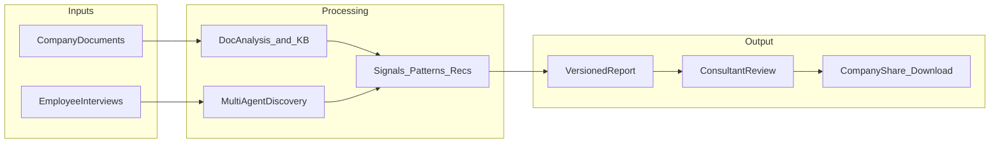
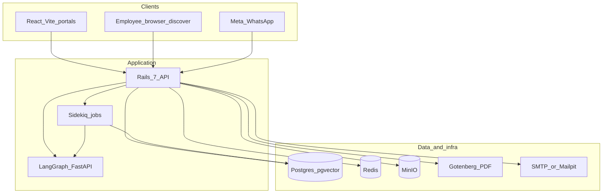
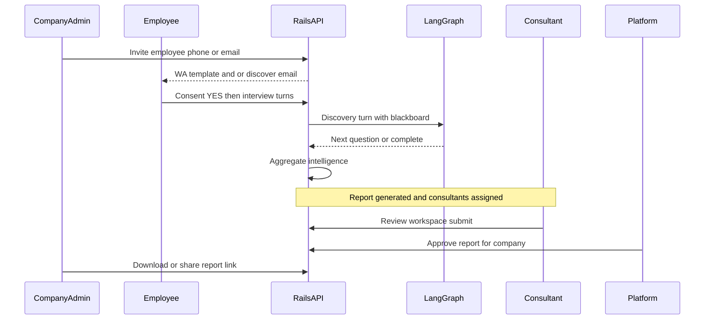
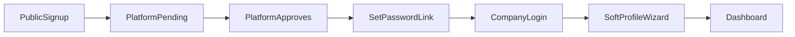
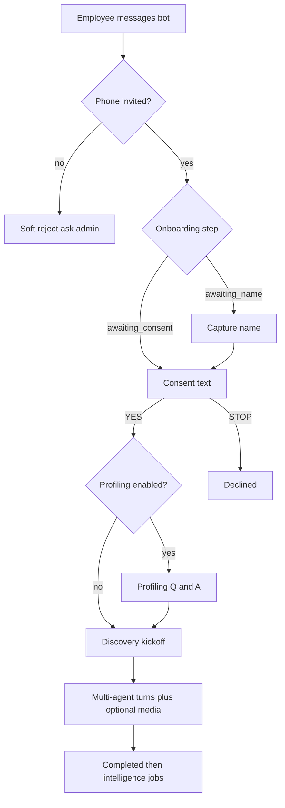
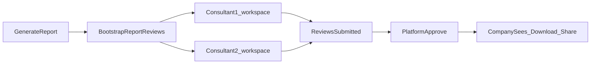

# Worktruth (Req) — Application Architecture & Portals Guide

**Audience:** product, engineering, and partner discussions covering architecture, functionality, and UI/UX.  
**Scope:** current shipped behavior (local + production-shaped).  
**Important:** Employee **access codes / OTPs have been removed**. Identity is **invite-first** (bound WhatsApp phone or personal web discover link) plus **consent**.

---

## Table of contents

1. [Executive overview](#1-executive-overview)
2. [System architecture](#2-system-architecture)
3. [Platform Admin](#3-platform-admin)
4. [Company portal (Client)](#4-company-portal-client)
5. [Consultant portal](#5-consultant-portal)
6. [Employee experience (WhatsApp + web)](#6-employee-experience-whatsapp--web)
7. [Cross-cutting product flows](#7-cross-cutting-product-flows)
8. [UI/UX principles as implemented](#8-uiux-principles-as-implemented)
9. [Appendix](#9-appendix)

---

## 1. Executive overview

### 1.1 What the product does

Worktruth helps organizations discover how work actually happens—approvals, tools, handoffs, pain points—then turn that evidence into **actionable intelligence** and a **reviewed report**.

Companies can start from **documents** (SOPs, spreadsheets, PDFs), from **employee interviews** (WhatsApp or browser chat), or both. Interviews are guided by an AI discovery system (optionally multi-agent specialists). Results are aggregated into signals, patterns, and recommendations. External **consultants** validate the report; **platform** can approve visibility; the **company** downloads and shares the finished artifact.

### 1.2 Actors

| Actor | Who they are | Primary surface |
|-------|----------------|-----------------|
| **Platform Admin** | Worktruth operators | `/platform/*` |
| **Company Admin (Client)** | Customer organization admin | `/company/*` |
| **Consultant** | External domain expert assigned by platform (max 2 per company) | `/consultant/*` |
| **Employee** | Interviewee inside the company | WhatsApp bot and/or `/discover/:token` |

There is also a `company_viewer` role in the data model; the UI currently presents a **Company Admin** experience for company portal users.

### 1.3 High-level value loop

**Docs-first path:** Upload documents → run analysis → knowledge base + clarification questions → signals without waiting for interviews.  
**Interview path:** Invite employees → consent → optional profiling → discovery chat → conversation complete → intelligence refresh.  
**Hybrid:** Documents establish a baseline; interviews strengthen evidence and readiness.

---

## 2. System architecture

### 2.1 Runtime stack

| Layer | Technology | Role |
|-------|------------|------|
| Frontend | React + Vite (`frontend/`) | Platform, company, consultant portals + employee discover UI |
| API | Rails 7 (`backend/`) | Auth, domain logic, webhooks, orchestration |
| Jobs | Sidekiq + Redis | WhatsApp processing, invites, nudges, media, analysis, intelligence |
| Agent | FastAPI LangGraph (`agent/`) | Discovery turns, routing, document analysis LLM graph |
| DB | Postgres 16 + pgvector | Primary store + embeddings |
| Objects | MinIO | Documents, report PDFs, media |
| PDF | Gotenberg | HTML → PDF for reports |
| Messaging | Meta Cloud API | WhatsApp templates + free-form (24h window) |
| Email | SMTP / Mailpit (dev) | Invites, nudges, password flows |

Local ports (default compose): frontend **5173**, Rails **3000**, LangGraph **8000**, Mailpit UI **8025**, MinIO **9000/9001**, Gotenberg **3001**, Postgres **5432**, Redis **6379**.

### 2.2 Authentication model

Four JWT audiences, never mixed:

| Audience | Subject | Used by |
|----------|---------|---------|
| `platform` | `platform_user:{id}` | Platform portal |
| `company` | `company_user:{id}` + `company_id` | Company portal |
| `consultant` | `consultant_user:{id}` | Consultant portal |
| `employee_web` | `employee:{id}` + `web_session_id` | Browser discover chat |

- Tokens carry a `jti` checked against the active user/session.
- Company access also requires company approval and an active subscription (unless platform is **impersonating**).
- **Impersonation:** Platform starts a company-audience JWT with `impersonation: true`; UI shows an exit banner and restores the platform session.

Password reset / set-password flows live under shared `/auth/*` routes with a portal query param where needed.

### 2.3 Security model for employees (current)

| Control | Behavior |
|---------|----------|
| Invite-first | Admin must create the employee record before the bot or web link works |
| WhatsApp identity | Global unique `phone_e164`; unknown numbers get a soft reject (“ask your admin”) |
| Web identity | Unguessable `/discover/{token}` link; **single-use** verify issues JWT |
| Consent | Explicit YES (localized keywords) before discovery starts |
| Opt-out | STOP / unsubscribe / cancel declines participation |
| No access codes | Codes, rotate/reissue, and related tables are removed |

Residual risk accepted: a correctly invited phone (or leaked discover link) plus consent is enough to complete an interview.

### 2.4 Core data flow (invite → share)

---

## 3. Platform Admin

### 3.1 Purpose

Operate the multi-tenant product: approve who gets in, create/manage companies and consultants, assign experts, watch health, curate discovery playbooks and solution catalog, approve reports for customer visibility, and support customers via impersonation.

### 3.2 Access

- **URL:** `/platform/login`
- **API:** `POST /api/v1/auth/platform/login`
- **Roles** on `PlatformUser`: `super_admin`, `support`, `analyst` (Pundit scopes platform audience to all companies)
- Session stored client-side as portal `platform`

### 3.3 Primary navigation

From `frontend/src/portals/platform/nav.ts`:

| Nav item | Path | What it is for |
|----------|------|----------------|
| Dashboard | `/platform/dashboard` | Operator snapshot |
| Registrations | `/platform/registrations` | Approve/reject company signups and consultant applications |
| Companies | `/platform/companies` | List/create companies; open detail; impersonate |
| Consultants | `/platform/consultants` | Consultant directory and detail |
| Trials | `/platform/trials` | Trials ending soon; extend |
| Playbooks | `/platform/playbooks` | Discovery playbook content by department |
| Solutions | `/platform/solutions` | Solution catalog entries |
| Sources | `/platform/catalog/sources` | External catalog sources + sync |
| Candidates | `/platform/catalog/candidates` | Approve/reject/merge catalog candidates |
| System | `/platform/system` | LangGraph, Gotenberg, Redis, WhatsApp delivery metrics |
| Monitoring | `/platform/monitoring` | Broader operational metrics |
| Audit log | `/platform/audit` | Audited platform actions |

### 3.4 Registrations

- **Company signup** arrives from public `POST /api/v1/public/company_registrations` (company name, admin name/email/**phone**, optional website; rate-limited).
- Platform **approves** → admin receives set-password email → can log into company portal.
- **Consultant apply** via `/consultant/apply` → platform approve/reject → active consultant can log in.
- Rejected or pending users cannot authenticate.

### 3.5 Companies

**List / create**

- Create company optionally with admin user and a **14-day trial** subscription.
- Update display name, locale, settings.
- **Impersonate** from the companies UI: becomes company admin JWT for support (2h session), audited.

**Company detail tabs** (deep workspace):

| Tab | Content |
|-----|---------|
| Overview | Company status, high-level stats |
| Conversations | Interview list/detail access |
| Intelligence | Signals, patterns, recommendations, timeline |
| Client stack | Inferred/known systems (`CompanySystem`) |
| Agentic ideas | Synthesize / publish / archive ideas |
| Reports | Download; **Approve** for company visibility |
| Consultants | Assign/remove consultants (**max 2 active** per company) |
| Audit | Company-related audit events |

### 3.6 Consultants (platform management)

- CRUD-ish management of `ConsultantUser` (status, verification flags, CV download).
- Assign to companies via `ConsultantAssignment` (`active` / `removed`).
- Can read co-consultant chat for support visibility.

### 3.7 Trials

- List companies with trials ending within ~7 days.
- **Extend** (default +7 days), audited.

### 3.8 Playbooks & catalog

- **Playbooks:** Department-scoped discovery prompt structures used when Rails builds LangGraph context.
- **Solutions / Sources / Candidates:** Maintain the recommendation catalog that intelligence and consultants can match or endorse against.

### 3.9 System & monitoring

- **System:** Health of LangGraph, Gotenberg, Redis; WhatsApp delivery metrics (24h).
- **Monitoring:** Tenancy-wide view (companies, subscriptions, discovery, multimodal, reports, impersonations).

### 3.10 Report approval (platform gate)

When consultants are assigned:

1. Consultants submit their `ReportReview`.
2. Platform **Approve** on the company report (unless company setting `skip_platform_review`).
3. Report becomes `shared_with_company` / platform-approved; company can view/download/share.

Settings such as `allow_early_report` affect whether generation can run before readiness thresholds (used in demos/seeds).

### 3.11 UI/UX notes (platform)

- Dense operator UI: tables, tabs, status badges.
- Impersonation is an explicit, visible mode so support does not confuse “self” with the customer.
- Catalog and playbooks are content-ops surfaces, not customer-facing marketing pages.

---

## 4. Company portal (Client)

### 4.1 Purpose

The customer’s home: configure the organization, upload documents, invite employees, watch interviews, answer consultant questions, review intelligence, and consume shared reports. **Companies do not generate reports in the UI**—generation/review is consultant/platform; company **views, downloads, and shares**.

### 4.2 Access journey

1. **Signup** `/company/signup` — company + admin identity (phone required).
2. Wait for platform approval + confirmation email.
3. **Set password** `/auth/set-password`.
4. **Login** `/company/login` — blocked if not approved or subscription inactive.
5. If `portal_onboarding_completed_at` blank → forced to **Profile** wizard (can Skip).
6. Otherwise **Dashboard**.

Forgot password: `/auth/forgot-password?portal=company`.

### 4.3 Primary navigation

From `frontend/src/portals/company/nav.ts`:

| Order | Label | Path | Role |
|-------|-------|------|------|
| 1 | Dashboard | `/company/dashboard` | Home / KPIs / next actions |
| 2 | Documents | `/company/documents` | Upload & analyze files |
| 3 | Knowledge | `/company/knowledge` | KB + clarification answers |
| 4 | Employees | `/company/employees` | Invite, nudge, phone edit |
| 5 | Conversations | `/company/conversations` | Interview transcripts |
| 6 | Discovery questions | `/company/discovery-questions` | Question-level feedback (not answers) |
| 7 | Intelligence | `/company/intelligence` | Signals / patterns / recs / timeline |
| 8 | Consultant questions | `/company/outreaches` | Approve/answer consultant outreaches |
| 9 | Consultants | `/company/consultants` | See assigned published experts |
| 10 | Reports | `/company/reports` | View / download / share |
| 11 | Profile | `/company/onboarding` | Org questionnaire + account |
| 12 | Settings | `/company/settings` | Org prefs; links to Billing & Media |

**Under Settings (secondary):**

- **Billing** `/company/billing` — trial/plan, conversation usage, Stripe/mock upgrade  
- **WhatsApp media** `/company/media` — inbound media library  

Shell: sidebar, notification bell (poll ~30s), optional integration warnings (OpenAI / Gotenberg / Stripe), impersonation banner when applicable.

### 4.4 Profile / onboarding wizard

Soft-required **10 sections** (nothing hard-required; “fill what you can”):

1. Company Profile  
2. Departments & Operations  
3. Current Technology  
4. Business Processes  
5. Data & Documents  
6. Customer Engagement  
7. Business Challenges  
8. AI Readiness  
9. Security & Infrastructure  
10. Business Goals  

Also on this page:

- Account name + **admin phone** (`PATCH /me`)
- Website URL (feeds web research when set)
- Progress, Save & continue, Finish, **Skip for now**

Completing sets `portal_onboarding_completed_at` and returns to dashboard.

### 4.5 Dashboard

Adapts to engagement phase:

| Phase | Emphasis |
|-------|----------|
| Docs processing, no signals yet | Action tiles (upload, profile, etc.) |
| Docs-only | KPIs: Documents / Signals / Patterns / Recommendations |
| Hybrid (interviews started) | In progress / Signals / Patterns / Recommendations |

Typical action tiles: Profile %, Assigned consultant, Conversations, Discovery questions (unanswered badge), Shared reports, Upload documents, Invite employees, WhatsApp media.

Also: stalled employees card (nudge CTA), participation funnel, department coverage, top pain points, emerging patterns, recent activity, trial usage line.

### 4.6 Documents

- Upload with department + “Visible to consultants”.
- Preferred formats: PDF, DOCX, XLSX, CSV, MD (others warned).
- **Analysis does not auto-start.** Admin explicitly runs Analyze / Update / Refresh grounding / Rebuild KB.
- Run kinds include default, incremental docs, profile reground, full rebuild.
- Row actions: Download, Replace, Delete, Show/Hide for consultants.
- Polling/toasts while processing.

Downstream: Knowledge entries + clarification questions; intelligence can update after runs complete.

### 4.7 Knowledge

- **Open clarification questions** from document analysis → company answers.
- Lists answered / auto-answered.
- Knowledge base entries with type, department, confidence, content.

### 4.8 Employees

**Invite form**

| Field | Notes |
|-------|-------|
| Phone E.164 | Required |
| Email | Optional; unlocks channel selector |
| Name | Optional (if present, employee skips name capture) |
| Department | Optional |
| Channel | `whatsapp` / `web` / `both` when email present |

**Delivery**

- WhatsApp (or both, not web-only): queues invite template job (`employee_discovery_invite` by default) with name, company, bot display number — **no code**.
- Web/both + email: email with personal discover URL only.
- Success toast: employee can message WhatsApp or open discover link.

**Identity (no codes)**

- WhatsApp: possession of invited phone.  
- Web: possession of discover link.  
- Then consent YES.

**Table / actions**

- Participation funnel: Invited → Started → Completed.
- Edit phone.
- **Nudge** if eligible (started, stalled ~48h inactive, **24h cooldown**); WhatsApp and/or email.
- Link to conversations.
- **Digest** modal: private employee value digests (needs email + opt-in).

**Conversation limits**

- Shown as `used / limit` from billing/dashboard.
- **Invites still succeed** at limit; limit is enforced when discovery **starts**.

Bulk invite API exists; no dedicated bulk UI.

### 4.9 Conversations

- List: employee, department, status, last activity.
- Detail: full transcript, shared media, discovery provenance (which agent/question lineage), question count.
- Empty states point to inviting employees or uploading documents.

### 4.10 Discovery questions

- Shows **questions only**, not employee answers (privacy).
- Feedback: Not relevant / Off-track → stored for product/playbook improvement.

### 4.11 Intelligence

Hash tabs: **Overview | Signals | Patterns | Recommendations | Timeline**.

- Overview: readiness %, counts.
- Signals: strength, departments, evidence, status.
- Patterns: confidence, description, departments.
- Recommendations: priority; feedback (Interested / Already doing / Not relevant); agentic ideas when published.
- Timeline: discovery activity over time.

### 4.12 Consultant questions (outreaches)

Consultants may ask the **company admin** or request contact with an **employee**.

| Outreach target | Company admin action |
|-----------------|----------------------|
| Company admin | Answer in side panel → Submit & close |
| Employee | **Approve** or **Decline** (optional note) before employee is contacted |

Statuses include `pending_admin_approval` and subsequent delivery states.

### 4.13 Consultants page

- Cards for assigned experts who have published profiles.
- Empty until platform assigns and consultant publishes.

### 4.14 Reports

- List shared/available reports.
- **View / download** (PDF/HTML) / **share** (public tokenized URL, ~30 days, access logged).
- No Generate button; policy denies company `create?`.
- Empty → guide back to dashboard / wait for consultant/platform.

### 4.15 Settings & billing & media

**Settings:** display name, locale (en/es/fr/de), security copy (invite-only identity), links to Billing and Media.  
**Billing:** plan/status/trial/renewal; conversation usage; upgrade **starter** ($499/mo, 100 conv) / **growth** ($1499/mo, 500) via Stripe or mock checkout.  
**Media:** inbound WhatsApp/web discovery media with previews and links to transcripts.

### 4.16 Notifications

Bell in shell: unread list, mark one/all read, navigate `action_url` (interview started, analysis ready, outreaches, etc.).

---

## 5. Consultant portal

### 5.1 Purpose

Independent experts validate discovery evidence and reports for assigned companies, request clarifications, optionally contact employees (often via company admin gate), endorse catalog fits, and collaborate with a co-consultant.

### 5.2 Access

- **Apply:** `/consultant/apply` → platform approval.
- **Login:** `/consultant/login` → only `active` consultants.
- JWT audience `consultant`.

### 5.3 Navigation

Sidebar is intentionally small (`frontend/src/portals/consultant/nav.ts`):

| Item | Path |
|------|------|
| Dashboard | `/consultant/dashboard` |
| Profile | `/consultant/profile` |
| Inbox | `/consultant/inbox` |

Company-scoped work is reached from the dashboard / company cards (not a long sidebar):

- `/consultant/companies/:companyId` — overview  
- `.../reports/:reportId/review` — full report workspace  
- `.../conversations`, `.../documents`, `.../analysis`, `.../catalog`  
- `.../employees/:employeeId/followup`  

### 5.4 Assignment model

- Platform creates `ConsultantAssignment` (active).
- **Maximum 2 active consultants per company.**
- Scope: consultant APIs only see assigned companies.

### 5.5 Dashboard & inbox

- Action queue: pending report reviews, open follow-ups, notifications.
- Inbox (`ConsultantFollowups`): follow-up threads + notifications.
- Legacy path `/consultant/followups` redirects to inbox.

### 5.6 Profile

- Questionnaire, avatar, CV upload/download.
- Publishing profile makes the consultant visible on the company Consultants page.

### 5.7 Company overview

Tabs typically include: **overview, profile, interviews, intelligence, clarifications, ideas**.

- Readiness and latest report CTA → workspace.
- Links to documents, analysis, catalog, conversations.
- Employee roster → follow-up pages.
- Clarifications: portal outreaches to **company admin** (no WhatsApp required).
- Agentic ideas panel; co-consultant chat drawer.

### 5.8 Report review workspace

Full-bleed layout. Guided steps (conceptually):

`context → evidence → synthesis → sections → collaborate → submit`

**Sections reviewed** (examples): executive summary, readiness, participation, delta, signals, patterns, recommendations.

Capabilities:

- PDF drawer alongside structured review
- Transcript + employee profile evidence
- Section status, comments, findings
- Co-consultant chat and review discussions
- Submit `ReportReview` (`pending` → `in_review` → `approved` / `rejected` / `needs_info`, etc.)

When all assigned consultants finish, platform can approve for company visibility.

### 5.9 How consultants contact employees

Two related mechanisms:

| Path | Gate | Delivery |
|------|------|----------|
| **Outreach** (clarification / evidence request) | Often **company admin approval** when target is employee | After approval: WhatsApp free-form if within **24h** of last activity; else Meta template `consultant_followup_reopen` (name + company) |
| **Direct follow-up / discussion “Ask employee”** | May use `ConsultantFollowup::SendService` | Same 24h vs template logic; creates `ConsultantInfoRequest`; inbound replies notify consultant |

Company-admin-targeted outreaches go to the company portal **Consultant questions** for answer.

### 5.10 Documents, analysis, catalog

- See company documents marked visible to consultants; download.
- Document analysis view; dismiss clarification questions.
- Catalog: browse fits; **endorse** solution matches.
- Agentic ideas: review/publish collaboration with platform/company visibility rules.

### 5.11 UI/UX notes (consultant)

- Expert workstation: deep company context, evidence-heavy report UI.
- Clear separation between **asking the company** (portal) and **pinging an employee** (WhatsApp, often admin-gated).
- Co-consultant collaboration is first-class when two consultants are assigned.

---

## 6. Employee experience (WhatsApp + web)

### 6.1 How employees get invited

Company admin invites with phone (required) and optional email/channel.

| Channel | What employee receives |
|---------|------------------------|
| WhatsApp | Meta template invite (default `employee_discovery_invite`): greeting with **name**, **company**, **bot number** |
| Web | Email with **personal discover URL** `/discover/{token}` |
| Both | Template + email |

No access code in either channel.

### 6.2 WhatsApp journey

**Details**

- Webhook: Meta → Rails verify signature → Sidekiq `ProcessWhatsappWebhookJob` → `InboundProcessor`.
- Idempotent on Meta message id (`WebhookEvent`).
- First inbound for named invites: if not YES yet, bot sends consent text; YES proceeds.
- Subscription **conversation limit** checked at discovery start.
- Media (voice/image/document) allowed in discovery after verified; blocked during onboarding/profiling with a notice.
- Routing priority for inbound text: outreach reply → consultant follow-up → profiling/discovery/onboarding.
- Language heuristics can set preferred language from early messages.

**Nudges:** If participation is `started` and stalled (~48h), company admin can send nudge template/email (24h cooldown).

### 6.3 Web discover journey

1. Open `/discover/:token`.
2. Landing shows company (and name if known).
3. **Continue** → `POST …/verify` (no code).
4. Session marked `verified_at` (**single-use**); JWT stored in `sessionStorage`.
5. Navigate to `/discover/:token/chat`.
6. Same onboarding/discovery handlers as WhatsApp, with `channel: "web"` (outbound persisted; no Meta send).
7. Attachments via multipart upload API.

Re-opening Continue on an already-used link returns a conflict (“already used”); chat JWT still works until session expiry if stored in the browser.

### 6.4 Profiling (optional)

Company setting `discovery_profiling_enabled`. Collects role title, department, seniority, responsibilities, team size, primary tools → builds agent routing profile → starts discovery.

### 6.5 Discovery (multi-agent)

When `discovery_multi_agent_enabled`:

- Rails holds conversation `state_snapshot` (blackboard, queue, active agent).
- Each turn: `LangGraph::Client` → agent `/turn` with playbook, history, profile, memory/docs/knowledge/media snippets.
- Specialists (process, technical, strategic, domain, compliance, etc.) rotate per orchestrator rules.
- Completion → `FinalizeConversationService` → `AggregateIntelligenceJob` + memory promotion.

Playbooks are department-aware content managed by platform.

### 6.6 Completion & participation statuses

| Status | Meaning |
|--------|---------|
| `invited` | Created; not yet engaged |
| `started` | First meaningful inbound / interview in progress |
| `completed` | Discovery finished |
| `declined` | Opted out |

---

## 7. Cross-cutting product flows

### 7.1 Document analysis → knowledge

1. Company uploads documents.  
2. Admin starts analysis run.  
3. Chunk/embed (pgvector) + LangGraph docs analysis graph.  
4. Writes `CompanyKnowledgeEntry`, clarification questions, analysis events.  
5. Company answers clarifications in Knowledge.  
6. Intelligence can incorporate document evidence.

### 7.2 Intelligence aggregation

Triggered after interviews complete and/or after analysis:

1. **Signals** extracted/upserted (`CompanySignal`)  
2. **Patterns** across signals/departments  
3. **Recommendations** (catalog-aware)  
4. Optional stack inference, catalog fit, agentic ideas  
5. Snapshot, readiness %, timeline, notifications  

Company and consultant portals both consume these layers with different write rights (e.g. recommendation feedback).

### 7.3 Report lifecycle

- HTML + Gotenberg PDF stored in MinIO.
- Visibility may stay internal until platform approval when consultants are assigned.
- Share links are tokenized public URLs with access logging.

### 7.4 Billing & conversation limits

- Trial on company create (typically 14 days).
- Paid plans (product copy): starter 100 conversations / growth 500.
- Limit checked when an employee **starts discovery**, not when invited.
- Company billing UI for upgrade; Stripe or mock checkout depending on env.

### 7.5 Notifications (all portals)

Domain events create in-app notifications (and sometimes email): interview started, analysis complete, outreaches, review tasks, etc. Each portal has its own notification endpoints and bell UI where implemented.

---

## 8. UI/UX principles as implemented

### 8.1 Portal shells

- Consistent sidebar + top bar pattern across platform/company/consultant.
- Company branding signal: company name in chrome; Worktruth product framing on marketing/auth.
- Consultant report workspace goes **full-bleed** to maximize evidence density.

### 8.2 Progressive engagement

- Soft profile: skippable, non-blocking.
- Docs-first messaging: you can get value before inviting anyone.
- Dashboard copy and KPIs change with docs-only vs hybrid state.

### 8.3 Privacy boundaries

| Role | Typically can see | Typically cannot |
|------|-------------------|------------------|
| Company admin | Own employees’ transcripts, media, intel, shared reports | Other companies; generate reports; raw consultant private notes beyond shared workflow |
| Consultant | Assigned company evidence, visible docs, reports under review | Unassigned companies; company billing |
| Platform | All tenants, approvals, impersonation | N/A (operator) |
| Company on discovery questions page | Question text | Employee answers |
| Employee | Own chat only | Portal intelligence/reports |

### 8.4 Trust & safety UX

- Explicit consent before interview content.
- Admin approval for many employee outreaches.
- Unknown WhatsApp numbers never enter the state machine.
- Discover links single-use at verify.
- Clear empty states that teach the next step (upload / invite / wait for consultant).

### 8.5 Operational honesty

- Analysis and intelligence are **explicit or job-driven**, not magic silent background for every upload.
- Integration warnings surface when OpenAI/Gotenberg/Stripe are misconfigured.
- Conversation limits explained at invite time vs start time.

---

## 9. Appendix

### 9.1 Docker Compose services (local)

| Service | Host port | Purpose |
|---------|-----------|---------|
| `frontend` | 5173 | React portals |
| `rails` | 3000 | API |
| `sidekiq` | — | Background jobs |
| `langgraph` | 8000 | Agent service |
| `postgres` | 5432 | Database |
| `redis` | 6379 | Queue/cache |
| `minio` | 9000 / 9001 | Object storage + console |
| `gotenberg` | 3001 | PDF |
| `mailpit` | 8025 / 1025 | Dev email UI / SMTP |

Prod overlay: `docker-compose.prod.yml`.

### 9.2 Key environment variables (conceptual)

| Area | Examples |
|------|----------|
| Meta WhatsApp | `META_*` tokens, phone number id, verify token, `META_TEMPLATE_EMPLOYEE_INVITE`, `META_TEMPLATE_EMPLOYEE_NUDGE`, `META_TEMPLATE_CONSULTANT_FOLLOWUP`, `META_WHATSAPP_DISPLAY_NUMBER` |
| Agent | `LANGGRAPH_URL`, OpenAI keys/models, `INTERNAL_API_TOKEN` |
| App | `APP_HOST` (discover URLs), `FROM_EMAIL`, Stripe keys |
| Storage | MinIO endpoints/credentials |

### 9.3 Glossary

| Term | Meaning |
|------|---------|
| Discovery | Guided interview about workflows/tools/pain |
| Profiling | Short pre-interview role/context capture |
| Signal | Atomic finding extracted from evidence |
| Pattern | Higher-order theme across signals |
| Recommendation | Suggested action/solution fit |
| Playbook | Prompt/structure for discovery by department |
| Outreach | Consultant-initiated question to admin or employee |
| Readiness | Score reflecting completeness/quality of evidence |
| Blackboard | Conversation state for multi-agent orchestration |
| Impersonation | Platform acting as company admin for support |

### 9.4 Primary code map

| Concern | Location |
|---------|----------|
| Company UI | `frontend/src/portals/company/` |
| Consultant UI | `frontend/src/portals/consultant/` |
| Platform UI | `frontend/src/portals/platform/` |
| Employee web UI | `frontend/src/employee/` |
| API routes | `backend/config/routes.rb` |
| Invite | `backend/app/services/invite_employee_service.rb` |
| WhatsApp inbound | `backend/app/services/whatsapp/` |
| Web discover session | `backend/app/services/employee_web_sessions/` |
| Discovery turns | `backend/app/services/discovery/` |
| LangGraph client | `backend/app/services/langgraph/client.rb` |
| Agent graphs | `agent/app/multi_agent_graph.py`, `docs_analysis_graph.py` |
| Intelligence | `backend/app/services/intelligence/` |
| Reports | `backend/app/services/reports/` |

### 9.5 What deliberately is *not* in the product anymore

- Per-employee access codes / OTP entry on WhatsApp or web  
- Rotate/reissue access code company settings  
- Admin “confirm last 4 digits” invite friction (removed by product choice)

---

*Document generated for architecture / functionality / UI-UX discussion. Reflects the codebase as of the access-code removal and invite-first employee model.*
