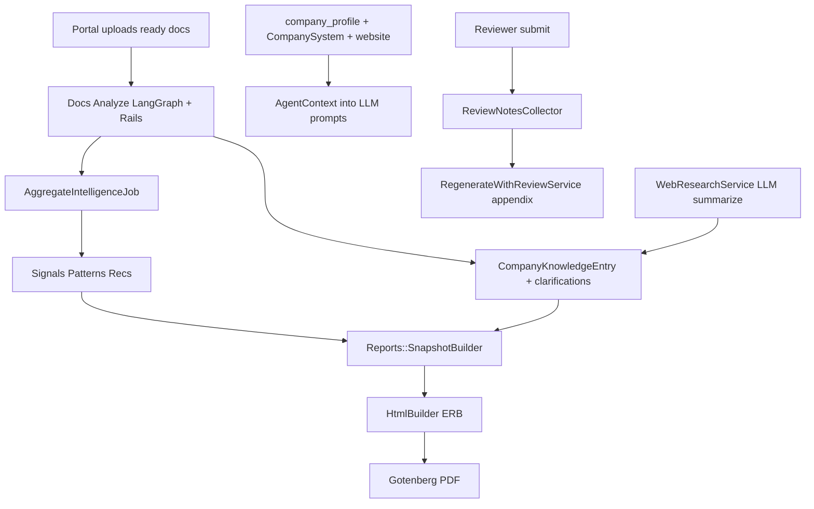

# Full local E2E analysis — company 10 (salman butt llc)

**Date:** 2026-07-26  
**Environment:** Docker Compose + **LM Studio** (Gemma-4-12b-qat + EmbeddingGemma 768-d)  
**Not in this pass:** live Meta WhatsApp (token blank) — deferred to **prod checklist** below.

Artifacts in this folder:
- [e2e_llm_summarize.json](./e2e_llm_summarize.json) — live Gemma summarize sample
- [e2e_intel_sample.json](./e2e_intel_sample.json) — signals / pattern / rec
- [e2e_kb_clarifications.json](./e2e_kb_clarifications.json) — KB + open clarification Qs from docs Analyze
- [e2e_review_overlay.json](./e2e_review_overlay.json) — submitted reviewer Layer C
- [e2e_report_v1_reviewed.pdf](./e2e_report_v1_reviewed.pdf) — PDF after review regenerate
- [e2e_report_with_review.html](./e2e_report_with_review.html) — HTML with appendix

---

## 1. How content is generated (pipeline)

| Stage | LLM? | What we observed locally |
|-------|------|---------------------------|
| Embeddings | Yes (EmbeddingGemma) | **PASS** dim=768 |
| Doc / web summarize | Yes (Gemma via Rails `Openai::Client`) | **PASS** after client fixes (see §5) |
| Docs Analyze graph | Yes (LangGraph → Gemma) | Prior run produced KB + 5 open clarifications (samples below) |
| Signal/pattern/rec | Mostly **rules** + thresholds | 6 signals, 1 pattern, 1 rec (strengths ≤0.58; pattern gate lowered for test) |
| PDF narrative | Template + snapshot strings | baseline / docs-first; Company context slide present |
| Reviewer text | Human | Overlay → PDF appendix on regenerate |

---

## 2. LLM response samples (local Gemma)

### 2a. Rails `summarize_document` (live this run)

From [e2e_llm_summarize.json](./e2e_llm_summarize.json):

- **Summary:** GulfLink freight AP via ERP + manual tools; bottlenecks and data fragmentation.
- **Tools:** Excel, SAP, WhatsApp  
- **Friction:** 8–12 day approvals; WhatsApp customs notes; warehouse sheet missing headers  
- **Confidence:** 0.95  

Quality: coherent and grounded in the prompt — good enough for local eval. Gemma-4 often puts text in `reasoning_content` with empty `content`; client now falls back to reasoning text and tolerates string-shaped API errors.

### 2b. Docs Analyze outputs (from earlier full Analyze)

Knowledge titles (LLM-extracted): *Cost Tracking*, *Lack of Data Context*, *Warehouse Expenditure Data*, *Coordination Overhead*, plus website research.

Clarification questions (still **open**, awaiting company answers), e.g.:

- Common data-entry error types?
- How many stakeholders in PO approval chain?
- Current vs target time-to-pay?
- Freight billing reconciliation walkthrough?
- How docs support cost / productivity / accuracy goals?

These are the right shape for a logistics AP pilot — they should be answered in Knowledge before claiming “interview-grade” depth.

### 2c. Derived intelligence (non-LLM extractors)

| Item | Value |
|------|--------|
| Top signal | Manual data entry and spreadsheets (0.58) |
| Pattern | Approval bottleneck across manual workflows (conf 0.82) |
| Rec | Automate manual data entry (medium) |

Excerpts on signals were empty in the sample dump — evidence is thinner than ideal for client delivery; worth checking `source_excerpts` population on next Analyze.

---

## 3. Report / PDF analysis

| Check | Result |
|-------|--------|
| Report id | **36** v1, `application/pdf`, `baseline` / docs-first |
| Company context | Website, 11 systems, KB themes |
| Signals / patterns / recs | Present |
| Tools catalog | 5 matches (e.g. UiPath endorsed in E2E) |
| Participation | Omitted correctly (0 invited / 0 completed) |
| Review appendix after submit | **Present** — overall note, recommendations `needs_info` comment, publishable executive finding |

**Reviewer-facing visibility:** report stays `internal_only` while reviews are in flight — company download 403; reviewer download OK.

---

## 4. Reviewer end-to-end (what they see / do)

| Surface | Status for company 10 |
|---------|------------------------|
| Profile tab | Firmographics + stack + web research API |
| Documents / Analysis | Docs-first evidence |
| Source evidence / Agent synthesis steps | Empty until interviews — empty-states added |
| Report sections | Structured dispositions + comments |
| Catalog | Endorse matches (UiPath endorsed in E2E) |
| Agentic ideas | Published E2E idea → next PDF opportunities |
| Submit | Status **`needs_info`** (because recommendations marked needs_info) |

### Reviewer response captured

- Overall note: validate AP bottleneck with finance interviews  
- Section comment on recommendations: SAP AP vs Excel first?  
- Publishable finding: AP approval bottleneck across finance/ops  
- Catalog endorsement: UiPath  
- Agentic idea: AP intake automation for Jebel Ali invoices (**published**)

Overlay JSON: [e2e_review_overlay.json](./e2e_review_overlay.json) — 2 notes, 7 dispositions, 1 publishable finding.

---

## 5. Bugs fixed during this E2E

1. **`Openai::Client#chat` missing** in WebResearch → switched to `summarize_document`.
2. **Gemma empty `content` / reasoning-only** → `message_text` fallback.
3. **`Hash#dig` into string error** when API returns `"error": "…"` string → safe error parsing.
4. Documents UI: Download + Updated; hide purged failed rows.
5. Reviewer empty evidence/synthesis: docs-first empty states.

---

## 6. Local scorecard (this run)

| Area | Result |
|------|--------|
| Embedding | PASS |
| LLM summarize | PASS |
| Web research + KB | PASS (example.com is placeholder content — expected) |
| Agent context pack | PASS |
| Report PDF generate | PASS |
| LangGraph health | PASS |
| Reviewer comment / finding / catalog / idea | PASS |
| Review submit | PASS (`needs_info`) |
| PDF appendix regenerate | PASS |
| WhatsApp interview loop | **SKIP** (no Meta token) |
| Full docs re-Analyze this session | **SKIP** (prior Analyze still valid; ~15–20 min) |

---

## 7. Prod test checklist (OpenAI + WhatsApp)

Do **after** push, with PROFILE A (OpenAI) and Meta credentials set:

1. Switch `.env` to OpenAI keys; recreate `rails sidekiq langgraph`.
2. Confirm chat JSON mode (`OPENAI_JSON_MODE=true`) and embeddings.
3. Upload / Analyze GulfLink (or prod fixture) — watch LangGraph logs for specialist extract + question generator.
4. Set **real** `website_url`; Refresh website research; confirm KB summary quality.
5. Invite 1–2 employees with WhatsApp; complete discovery; confirm AggregateIntelligence and readiness blend.
6. Generate report; company + reviewer download paths.
7. Reviewer: Profile → Catalog endorse → Agentic idea publish → Report sections → Submit.
8. Platform approve → regenerate PDF with appendix; confirm findings appear, discussions do not.
9. Optional: answer clarification Qs in Knowledge; re-run incremental analysis.

### Local vs prod expectations

| | Local (Gemma) | Prod (OpenAI) |
|--|---------------|---------------|
| Latency | Slow (30–90s/call) | Faster |
| JSON reliability | Needs fallbacks | Stronger with json_object |
| WhatsApp | Simulate / skip | Live Meta templates |
| Content quality | Good for plumbing tests | Client-ready bar |

---

## 8. Verdict

**Local E2E plumbing is green** with live LM Studio LLMs for summarize/embed, full report PDF, and a complete reviewer Layer C loop into the PDF appendix.

**Gaps before calling it “client ready”:** WhatsApp interview path untested here; clarification Qs unanswered; signal excerpts thin; website is `example.com` (replace with real domain); pattern/rec strength restored to **0.65**; run one fresh full Docs Analyze on OpenAI in prod for quality comparison.

---

## 9. Re-verify pass (2026-07-26 afternoon) — dashboards + Gemma token budget

### LLM regression (why Gemma looked “broken”)

Gemma-4 via LM Studio burns completion tokens on `reasoning_content` before writing `content`. Tight `max_tokens` truncated mid-thought (`finish_reason=length`, empty answer).

**Fixes in `Openai::Client`:**
- Local/LM Studio floor: `chat_max_tokens` ≥ 2500 (override `OPENAI_MAX_TOKENS`)
- All chat reads via `message_text` (content → reasoning fallback)
- Honor `OPENAI_JSON_MODE=false` (skip `response_format` for local)

**Smoke this pass:**
- `embedding` dim=768 PASS
- `summarize_document` PASS (coherent AP/SAP/Excel summary; `max=2500`)

### Dashboard enhancements verified via API

| Portal | New data | Observed (company 10) |
|--------|----------|------------------------|
| Company | `intel_counts` + readiness/dept bar charts | readiness 100; docs 5/5; signals 6; patterns 1; clarifications open 5; recs 1; systems 11 |
| Reviewer | portfolio bars + `completion_rate` / `ready_documents` | avg readiness 100; ready docs 5; pending reviews 1; participation 0% (no invites) |

### E2E state still green

Report **#36** ready + PDF; review status `needs_info`; WhatsApp still SKIP.
